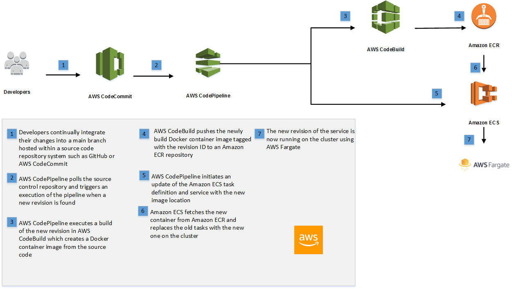

# ECS Fargate Node Demo: Continuous Deployment

This application builds on a Node JS based app demo and demonstrates how to do
[continuous integration][continuous-integration] and 
[continuous deployment][continuous-deployment]of an application to Amazon
Elastic Container Service (Amazon ECS) using AWS CodePipeline and AWS
CodeBuild. With continuous deployment, software revisions are deployed to a
production environment automatically without explicit approval from a developer,
making the entire software release process automated.

Launching this AWS CloudFormation stack provisions a continuous deployment
process that uses AWS CodePipeline to monitor a GitHub repository for new
commits and AWS CodeBuild to create a new Docker container image and to push it
into Amazon Elastic Container Registry (Amazon ECR).

This stack deploys the service onto [AWSFargate][fargate]. AWS Fargate allows 
you to run containers without managing clusters or services. 

[][architecture]

## Running the example

#### 1. Fork the GitHub repository

[Fork](https://help.github.com/articles/fork-a-repo/) the [Amazon ECS sample
app](https://github.com/awslabs/dc-summit-2018-node-ecs-fargate-demo) GitHub repository into
your GitHub account.

From your terminal application, execute the following command (make sure to
replace `<your_github_username>` with your actual GitHub username):

```console
git clone https://github.com/<your_github_username>/dc-summit-2018-node-ecs-fargate-demo
```

This creates a directory named `dc-summit-2018-node-ecs-fargate-demo` in your current
directory, which contains the code for the Amazon ECS sample app.

#### 2. Create the CloudFormation stack

[us-east-1]: https://console.aws.amazon.com/cloudformation/home?region=us-east-1#/stacks/create/review?stackName=ECS-ContinuousDeployment&templateURL=https://s3.amazonaws.com/awshenry.com/cf-template.yml