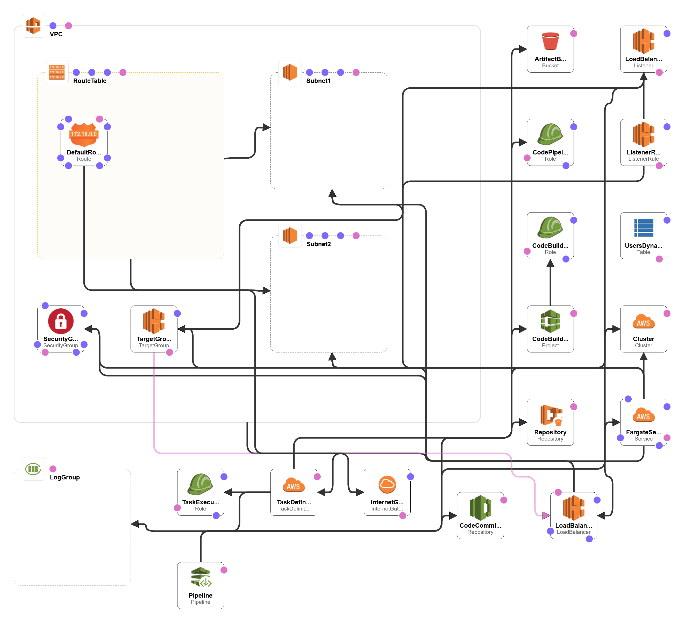

# ECS Fargate Node Demo: Continuous Deployment

This application builds on a Node JS based app demo and demonstrates how to do
[continuous integration][continuous-integration] and 
[continuous deployment][continuous-deployment]of an application to Amazon
Elastic Container Service (Amazon ECS) using AWS CodeCommit, AWS CodePipeline and AWS
CodeBuild. With continuous deployment, software revisions are deployed to a
production environment automatically without explicit approval from a developer,
making the entire software release process automated.

Launching this AWS CloudFormation stack provisions a continuous deployment
process that uses AWS CodePipeline to trigger based on commits to a Code Commit 
Repository and AWS CodeBuild to create a new Docker container image and to push it
into Amazon Elastic Container Registry (Amazon ECR).

This stack deploys the service onto [AWSFargate][fargate]. AWS Fargate allows 
you to run containers without managing clusters or services. 

][architecture]

## Running the example

#### 1. Fork the GitHub repository

[Fork](https://help.github.com/articles/fork-a-repo/) the [Node ECS CICD Demo App](https://github.com/dc-summit-2018-node-ecs-fargate-demo) GitHub repository into
your GitHub account.

From your terminal application, execute the following command (make sure to
replace `<your_github_username>` with your actual GitHub username):

```console
git clone https://github.com/<your_github_username>/dc-summit-2018-node-ecs-fargate-demo
```

This creates a directory named `dc-summit-2018-node-ecs-fargate-demo` in your current
directory, which contains the code for the Amazon ECS sample app.

#### 2. Create the CloudFormation stack

[us-east-1]: https://console.aws.amazon.com/cloudformation/home?region=us-east-1#/stacks/create/review?stackName=CICD-Demo&templateURL=https://s3.amazonaws.com/awshenry.com/cf-template.yml

][infrastructure]

This reference architecture can only be deployed to Regions which have all
necessary services available. See the [Region
Table](https://aws.amazon.com/about-aws/global-infrastructure/regional-product-services/)
for information about service availability.

The CloudFormation template has no parameters:

The CloudFormation stack provides the following output:

- **ServiceUrl**: The sample service that is being continuously deployed.
- **PipelineUrl**: The continuous deployment pipeline in the AWS Management
  Console.
- **ClusterName**: The ECS Fargate Cluster that will host your app.
- **DynamoDBTable**: The DynamoDB Table that hosts the Users info for the app.
- **TargetGroup**: TargetGroup for the ECS Fargate Service
- **VpcId**: The VPC is created for hosting your Service
- **CodeRepository**: The Code Commit Repository for hosting your code

### Setting up CICD

The template deploys all the AWS service components that you will need for your
CICD project.  However, you will have to commit the demo application to the 
Code Commit Repository to have a fully working CICD process.  That check in
will trigger a Docker build as well as the push to ECS of the service based on
the code you committed.

### Testing the example

To test continuous deployment, make a change to views/index.pug (or any other pug or js file) in the
repository and push it to CodePipeline. CodePipeline detects
the change, builds the new application, and deploys it to your cluster
automatically. After the pipeline finishes deploying the revision, reload the
page to see the changes made.

### Cleaning up the example resources

To remove all resources created by this example, do the following:

1. Delete the main CloudFormation stack which deletes the substacks and resources.
1. Manually delete resources which may contain content:

    - S3 Bucket: ArtifactBucket
    - ECR Repository: Repository
	- DynamoDB Table:  
